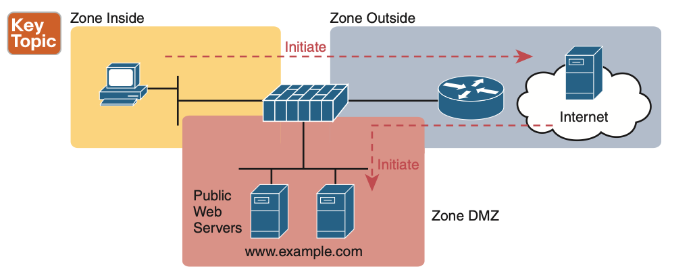
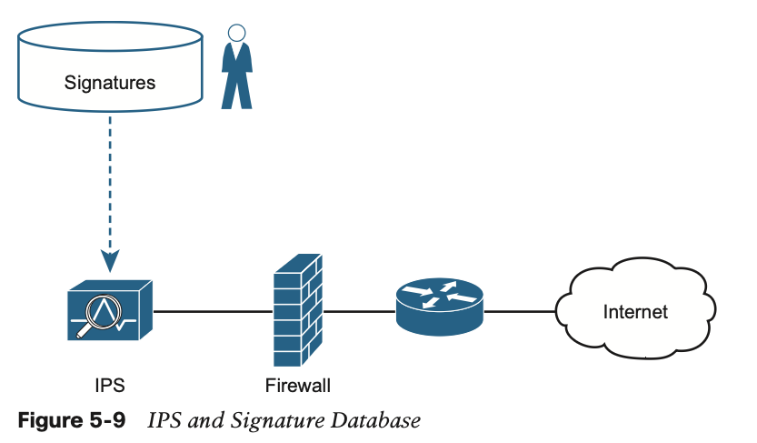

## Chapter1. Introduce TCP/IP Model
<hr>


## Chapter2. Standard ACL Lists
<hr>

## Chapter3 . Advanced IPv4 Access Control Lists

<hr>

This Chap -> Covers the "Security Fundamentals" -> Configure and verify access control lists

### Do i Know This Already Quiz

1. Which of the following fields cannot be compared based on an extended IP ACL?
   1. Protocol
   2. Source Ip Address
   3. Destination Ip address
   4. TOS byte
   5. URL
   6. Filename for FTP transfers 
    -> URL, FIlename for FTP transfers
2. Which of the following access-list commands permit packets going from host 10.1.1.1 to all web servers whose IP addresses begin with 172.16.5? (Choose two answers)
   1. access-list 101 permit tcp host 10.1.1.1 172.16.5.0 0.0.0.255 eq www
   2. access-list 1951 permit ip host 10.1.1.1 172.16.5.0 0.0.0.255 eq www
   3. access-list 2523 permit ip host 10.1.1.1 eq www 172.16.5.0 0.0.0.255
   4. access-list 2523 permit tcp host 10.1.1.1 eq www 172.16.5.0 0.0.0.255
   5. access-list 2523 permit tcp host 10.1.1.1 172.16.5.0 0.0.0.255 eq www
    -> i don't know
3. Which of the following access-list commands permits packets going to any web client from all web servers whose IP addresses begin with 172.16.5?
   1. access-list 101 permit tcp host 10.1.1.1 172.16.5.0 0.0.0.255 eq www
   2. access-list 1951 permit ip host 10.1.1.1 172.16.5.0 0.0.0.255 eq www
   3. access-list 2523 permit tcp any eq www 172.16.5.0 0.0.0.255
   4. access-list 2523 permit tcp 172.16.5.0 0.0.0.255 eq www 172.16.5.0 0.0.0.255
   5. access-list 2523 permit tcp 172.16.5.0 0.0.0.255 eq www any

### Foundation Topics

- Extended Numbered IP Access Control Lists
  - Extended IP access lists have many similarities compared to the standard numbered IP ACLs discussed in the previous chapter.
  - First-Match Logic
  - it has the larger veriety of packet header.

1. Matching the Protocol -> 프로토콜 타입
2. Matching Source IP -> 근원지 IP
3. Matching Destination IP -> 목적지 IP 

- Statement<br>
  "access-list 101 permit (protocol) (source_ip) (destination_ip)"

- Protocol Type

| Protocol |                     |
|----------|---------------------|
| ip       | all of IPv4 Packets |
| tcp      | tcp packets         |
| udp      | udp packets         |
| icmp     | icmp packets        |

- source & destination IP<br>
    "Address & Wildcard"

* when you want to match specific IP address, you need to use "host" keyword before IP address

* example

| access-list Statement                            | What It matches                                      |                                                                                          |
|--------------------------------------------------|------------------------------------------------------|------------------------------------------------------------------------------------------|
| access-list 101 deny tcp any any                 | any에서 any로 가는 tcp 헤더가 포함된 패킷을 모두 거부한다.               | Any Ip packets that has a TCP header.                                                    |
| access-list 101 deny udp any any                 | any에서 any로 가는 UDP 헤더가 포함된 패킷을 모두 거부한다.               | Any IP packets that has a UDP header                                                     |
| access-list 101 deny icmp any any                | any에서 any로 가는 icmp 헤더가 포함된 패킷을 모두 거부한다.              | Any IP packets that has icmp header.                                                     |
| access-list 101 deny ip host 1.1.1.1 host 2.2.2.2 | 1.1.1.1에서 2.2.2.2로 가는 IP 패킷을 모두 거부한다.                | All packets from host 1.1.1.1 to host 2.2.2.2, regardless of the header after IP header. |
| access-list 101 deny udp 1.1.1.0 0.0.0.255 any   | 서브넷 1.1.1.0/24에서 any로 가는 udp 헤더가 포함된 IP 패킷을 모두 거부한다. | All IP packets from subnet 1.1.1.0/24 to any  has udp header.                            |

### Matching TCP and UDP Port Numbers

- Extended ACL also examine header in TCP and UDP. (Source, Destination Port Number).

- Statement <br>
  "access-list 101 permit (protocol) source IP (source_port) destination IP (destination_port)"
  - in the port number we can use comparison words like eq(=), lt(<), ne(!=), gt(>) (range: x to y)

- Popular Applications and Their Well-Known Port Numbers

| 포트번호          | 프로토콜     | Application       | access-list Command Keyword |
|---------------|----------|-------------------|-----------------------------|
| 20            | TCP      | FTP data          | ftp-data                    |
| 21            | TCP      | FTP control       | ftp                         |
| 22            | TCP      | SSH               | ---                         |
| 23            | TCP      | telnet            | telnet                      |
| 25            | TCP      | SMTP              | smtp                        |
| 53            | UDP, TCP | DNS               | domain                      |
| 67            | UDP      | DHCP server       | bootps                      |
| 68            | UDP      | DHCP client       | bootpc                      |
| 69            | UDP      | TFTP              | tftp                        |
| 80            | TCP      | HTTP              | www                         |
| 110           | TCP      | POP3              | pop3                        |
| 161           | UDP      | SNMP              | snmp                        |
| 443           | TCP      | SSL               | ---                         |
| 514           | UDP      | Syslog            | ---                         |
| 16,384~32,767 | UDP      | RTP(voice, video) | ---                         |

- Extended access-list Command Examples and Logic Explanations

- access-list의 목적이 뭔지 확인해보기

| access-list Statement                                      | What it matches                                                                                                                                    | 목적                                                                 |
|------------------------------------------------------------|----------------------------------------------------------------------------------------------------------------------------------------------------|--------------------------------------------------------------------|
| access-list 101 deny tcp any gt 49151 host 10.1.1.1 eq 23  | Packets with TCP header, and source IP with a source port greater than 49151, a destination of exactly 10.1.1.1 and a destination port equal to 23 | host 10.1.1.1로 가는 telnet을 거부, 소스 포트 번호가 49151 이상이면, 원격 제한을 걸어버리는 것 |
| access-list 101 deny tcp any host 10.1.1.1 eq 23           ||                                                                    |
| access-list 101 deny tcp any host 10.1.1.1 eq telnet       ||                                                                    |
| access-list 101 deny udp 1.0.0.0 0.255.255.255 lt 1023 any || 포트번호가 1023보다 작고 특정 서브넷 1.0.0.0/8로부터 오는 udp 헤더가 포함된 패킷을 거부          |

### Rules if you put access-list in the network.

1. Place extended ACLs as close as possible to the source of the packet.
2. Place Standard ACLs as close as possible to the destination of the packet.
3. Place more specific statements early in the ACL
4. Disable an ACL from its interface before making changes to the ACL

### Named Extended Access-list vs Numbered Extended Access-list

### Practice

1. 

## Chapter 4. Security Architectures

<hr>


### Common Security Threats, 주요 보안 위협


1. Attacks That Spoof Addresses, 주소 도용 공격 기법
   1. Denial-of-Service Attacks
   2. Reflection and Amplification
   3. Man-in-the-Middle Attacks
2. Reconnaissance Attacks, 정찰 공격 기법
3. Buffer Overflow Attacks, 오버플로우 공격 기법
4. Malware
5. Human Vulnerabilities
   1. Phishing
   2. Spear Phishing
   3. Whaling
   4. Pharming
   5. watering hole attack
   6. Vishing
   7. Smishing
6. Password Vulnerabilities
   1. Two-Factor Authentication
   2. Digital Certificates
   3. Biometric
   4. Main Idea
      1. Something you are
      2. Something you have
      3. Something you know
      
### Controlling and Monitoring User Access

- AAA Theory
  - Authentication
  - Authorization
  - Accounting


- AAA Protocol
  - TACACS+
  - RADIUS

### Developing a Security Program to Educate users

1. User Awareness
2. User Training
3. Physical Access Control

## Chapter 5. Securing Network Devices 

<hr>

### Securing IOS Password

- 다음 명령어를 이용해 비밀번호 설정을 하면, Config 파일에 비밀번호가 평문으로 저장된다.

```shell
password "password"
username "name" password "password"
```
<b>Encrypting Older IOS Passwords with service password-encryption</b>

-> 이를 암호화시켜 저장하기 위해서 "password-encryption" 명령어를 사용해야 한다.    

```shell
service password-encryption
```

-> 해당 명령어를 사용해, 평문을 암호문으로 변경했다면, "no" 명령어를 사용해 취소시킬 수 있나?를 생각해볼 수 있는데, 그건 불가능하다. <br>

만약 취소를 원한다면, no service password-encryption을 통해 암호화 저장을 취소하고, 비밀번호를 변경해야 한다.

<b>Encoding the Enable Passwords with Hashes</b>

더 강력한 암호화를 위해 "secret" keyword가 추가되었다.

```shell
enable secret
```

- Type에 따라 비밀번호 저장 방식을 설정할 수 있다.

| Command                                         | Type | Algorithm |
|-------------------------------------------------|------|-----------|
| enable [algorithm-type md5] secret password     | 5    | MD5       |
| enable [algorithm-type sha256]  secret password | 8    | SHA-256   |
| enable [algorithm-type scrypt] secret password  | 9    | SHA-256   |

- 사용자 계정을 만들 수 있다.

| Command                                                 | Type | Algorithm |
|---------------------------------------------------------|------|-----------|
| username "name" [algorithm-type md5] secret password    | 5    | MD5       |
| username "name" [algorithm-type sha256] secret password | 8    | SHA-256   |
| username "name" [algorithm-type scrypt] secret password | 9    | SHA-256   |

<b>Controlling Password Attacks with ACLs</b>

- Remote Line에 ACL 설정을 통해서 네트워크 관리자만 "네트워크 장비에" 접근 가능하게 할 수 있다.

```shell
line vty 0 4
  login
  password cisco
  access-class 3 in
!
!
!
access-list 3 permit 10.1.1.0 0.0.0.255
```

-> 10.1.1.0/24 subnet으로부터 들어오는 패킷만 허용합니다. 

<br>

### Firewalls and Intrusion Prevention Systems

<b>Traditional Firewalls</b>

1. firewall can choose which packets to discard and which to allow through. (same with ACLs)
2. firewall identify applications by matching TCP and UDP ports (well-known ports)
3. firewall watch application-layer flows to know what additional TCP and UDP ports are used.
4. it matches the text in the URI of an HTTP request.
5. it keeps state information by storing information about each packet. (stateful connection)


<b>Security Zones</b>



- Most Companies have an inside and outside zone, as well as a special zone called the demilitarized zone(DMZ).


### Intrusion Prevention Systems (IPS)

방화벽은 설정된 값에 따라 패킷의 통과 여부를 결정한다. IPS는 데이터베이스에서 패킷을 검사해 통과 여부를 결정한다.



-> 바이러스 데이터베이스를 관리해, 시스템 패킷 속 바이러스 검사를 통해 패킷 통과 여부를 결정할 수 있다.

### Cisco Next Generation FireWall, (NGFW, Next Generation FireWall)

<b>Cisco Adaptive Security Appliance</b>
 => SourceFire, a security company <- 여기 회사에서 제품을 가져와서 시스코가 판매.

- Challenges

1. Each IP-based application should use a well-known port/ 
2. Attackers know that firewalls will filter most well-known ports from sessions initiated from the outside zone to the inside zone
3. Attackers use port scanning to find any port that a company's firewall will allow through right now.
4. Attackers attempt to use a protocol of their choosing(HTTP) 

### Cisco Next Generation IPS (NGIPS, Next Generation Intrusion Prevention System)


