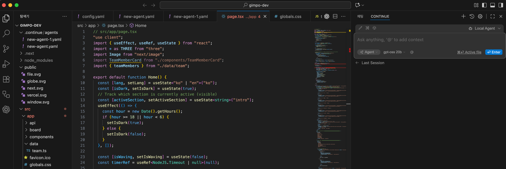

<hr>
LLM을 결합한 Application을 테스트 해본 것들에 대한 기록.

## Browser-Use
<hr>
Browser-Use는 LLM 에이전트를 기반으로 브라우저를 동작해 사용자가 원하는 목표를 달성하는 Application입니다.<br>

<a href="https://github.com/browser-use/browser-use">Browser-Use Github 공식 홈페이지</a>

-> 멀티 모달을 지원하는 로컬 LLM을 사용해 Application을 테스트해볼 수 있다.


```shell
pip install browser-use
uvx playwright install chromium --with-deps --no-shell
```


```python

```

### 사용후기

<video src="../assets/browser-use.mp4" type="video/mp4" autoplay muted loop playsinline controls style="width: 100%; max-width: 100%; height: auto; display: block; object-fit: contain;">
  Your browser does not support the video tag.
</video>


- 네이버에서 자동으로 블로그 글 작성을 요쳥했는데, 아직까진 한계가 있어 보인다.

## Parlant

<hr>

Parlant는 에이전트를 만들 때 좀 더 잘 작동하는 에이전트를 만들 수 있다.

<a href="https://github.com/emcie-co/parlant">Parlant Github 공식 홈페이지</a>

### Example 

```python
import parlant.sdk as p

@p.tool
async def get_weather(context: p.ToolContext, city: str) -> p.ToolResult:
    # Your weather API logic here
    return p.ToolResult(f"Sunny, 72°F in {city}")

@p.tool
async def get_datetime(context: p.ToolContext) -> p.ToolResult:
    from datetime import datetime
    return p.ToolResult(datetime.now())

async def main():
    async with p.Server() as server:
        agent = await server.create_agent(
            name="WeatherBot",
            description="Helpful weather assistant"
        )

        # Have the agent's context be updated on every response (though
        # update interval is customizable) using a context variable.
        await agent.create_variable(name="current-datetime", tool=get_datetime)

        # Control and guide agent behavior with natural language
        await agent.create_guideline(
            condition="User asks about weather",
            action="Get current weather and provide a friendly response with suggestions",
            tools=[get_weather]
        )

        # Add other (reliably enforced) behavioral modeling elements
        # ...

        # 🎉 Test playground ready at http://localhost:8800
        # Integrate the official React widget into your app,
        # or follow the tutorial to build your own frontend!

if __name__ == "__main__":
    import asyncio
    asyncio.run(main())
```

## openui

<hr>

OpenUI는 각 GPT 플랫폼 API를 끌어다가 사용할 수 있는 프로그램이다.<br>
로컬로 실행 중인 모델을 끌어다가 직접 사용해 로컬 환경에서 GPT 플랫폼들처럼 서비스를 쉽게 이용할 수 있다.<br>

<a href="https://github.com/wandb/openui">OpenUI Github 공식 홈페이지</a>

<br>


### From Source / Python


If you want to use local environment, follow below uv Commands<br>

```shell
git clone https://github.com/wandb/openui
cd openui/backend
uv sync --frozen --extra litellm
source .venv/bin/activate
# Set API keys for any LLM's you want to use
export OPENAI_API_KEY=xxx
python -m openui
```


## Continue 

<hr>

Continue는 다양한 LLM 서비스를 이용해, IDE에 탑재시켜 원하는 작업을 자유자재로 시킬 수 있는 플러그인이다.

<a href="https://www.continue.dev/">Continue 공식 홈페이지</a>

<br>

### 비주얼 스튜디오 코드에 Continue Plugin을 설치해 로컬 LLM을 통해 작동.

- 특정 LLM 모델에 잘 작동하기 때문에 해당 모델로 돌릴 필요가 있다. 
- 작업마다 다른 LLM이 필요하므로 GPU RAM이 많이 필요하다.




- 사진과 같이 오른쪽에 채팅 영역이 생긴다.


